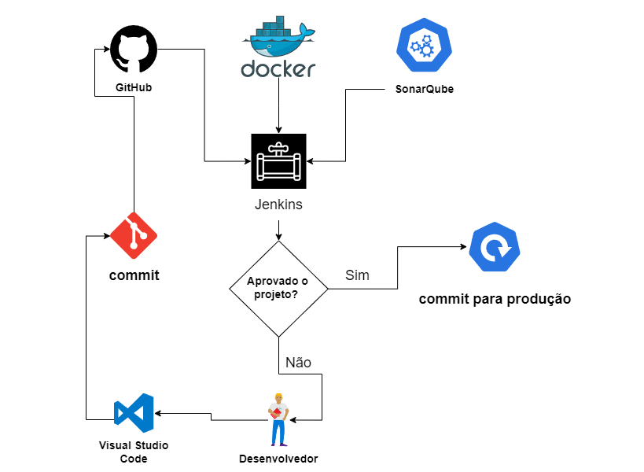

<h1 align="center">AVSAC</h1>
<h2 align="center">Análise de Vulnerabilidades e Segurança Aplicado ao Código   
  
  
  
  
   
</h2>

  

    
  

# Introdução 

Com o aumento dos ataques de hackers nas empresas, a preocupação com a segurança cibernética tem se intensificado. Aproximadamente um quarto das companhias brasileiras relataram perdas financeiras devido a ataques digitais em 2022, com a maioria relatando casos de roubo de dados, segundo uma pesquisa anual realizada pela empresa de segurança Proofpoint, como aponta na matéria da Forbes em 06 de março de 2023. Outra notícia que impacta o mundo dos negócios, que no ano de 2018, foi sancionada a Lei nº 13.709 (Lei Geral de Proteção de Dados - LGPD), que estabelece um conjunto de regras para coleta, tratamento, armazenamento e compartilhamento de dados pessoais. A primeira multa pelo descumprimento de determinações da LGPD (Lei Geral de Proteção de Dados) foi aplicada no Brasil. Foram duas sanções administrativas de R$ 7.200, cada, totalizando R$ 14.400, à Telekall Infoservice, do ramo de telefonia, sediada em Vila Velha (ES), matéria citada no canal de notícias da Uol no dia 10 de agosto de 2023. Isso só demonstra um alerta que as empresas, precisa implementar as boas práticas de segurança da informação em suas aplicações que estão publicamente na internet. O projeto propõe uma iniciativa para que as empresas adotem boas práticas de segurança da informação em seus processos de desenvolvimento de aplicações, com foco na automação da avaliação da infraestrutura como código. A proposta visa a integração de uma ferramenta de código aberto, como o SonarQube, nas etapas do processo de integração e entrega contínuas (CI/CD), para realizar a varredura e a avaliação do nível de segurança das aplicações.
A configuração do CI/CD incluirá a implementação do SonarQube para conduzir scans automáticos, avaliando a conformidade com as diretrizes de segurança estabelecidas, como as da OWASP (Open Web Application Security Project). Este processo visa identificar vulnerabilidades e promover práticas de desenvolvimento mais seguras desde o início do ciclo de vida do software.
Com esta abordagem, o projeto busca não apenas automatizar a análise de segurança, mas também integrar a segurança como uma prática contínua e consistente ao longo de todo o processo de desenvolvimento de aplicações, assegurando que as melhores práticas de segurança sejam seguidas de forma sistemática e eficiente.

# Resumo da proposta 

Em tempos passados, equipes operavam de forma isolada e compartimentada, cada uma com
responsabilidades específicas. Por exemplo, o time de desenvolvimento criava a aplicação e a
repassava ao time de operações, encarregado de implementar e realizar o deploy. No entanto, neste
novo contexto, surgem diversas práticas que promovem integração e agilidade, como automação,
integração contínua, deploys contínuos (CI/CD) e infraestrutura como código. Depender de
processos manuais para colocar uma aplicação em produção não é mais viável. A segurança deve
ser uma prática integrada à cultura DevOps desde o início, utilizando ferramentas de segurança
dentro do fluxo de verificação do código. Isso implica que a construção de uma aplicação deve
considerar requisitos de segurança desde o projeto de software. Em suma, a segurança não deve ser
uma preocupação secundária, mas sim um elemento essencial e integrado ao processo de
desenvolvimento de software em um ambiente DevOps.

# Objetivo Geral e Objetivos Específicos  

O objetivo geral do projeto é abordar as falhas de segurança presentes em aplicações externas desenvolvidas por empresas, buscando implementar uma cultura organizacional centrada em processos, em que a segurança é considerada uma parte fundamental e integrante das regras de negócio, respeitando a tríade da segurança que são integridade, confiabilidade e disponibilidade. 

O objetivo específico é estabelecer um fluxo que, antes de disponibilizar as aplicações externamente na internet, avalie os riscos de segurança presentes no código. Esse processo será desenvolvido em conjunto com ferramentas de código aberto para construir tal fluxo. Inicialmente, faremos uso do GitHub como repositório para as aplicações e códigos. Em seguida, abordaremos o Jenkins para criar pipelines que automatizem o processo de implantação contínua (CI/CD). Dentro dessas etapas de pipeline, o código será submetido a uma análise pela ferramenta SonarQube, que verificará como os requisitos de segurança estabelecidos pela empresa estão sendo atendidos, a fim de determinar se o código está pronto para ser implantado em produção. Este objetivo visa avaliar o código quanto ao cumprimento das boas práticas definidas pela OWASP, visando evitar vulnerabilidades de segurança que possam ser exploradas por hackers.

# Disciplinas do curso de Redes de Computadores Associada ao Projeto

O diferencial deste projeto reside na integração de diversas disciplinas do curso de Redes de Computadores do IFRN. Isso inclui disciplinas equivalentes à Administração de Sistemas Abertos, baseadas nos conteúdos de Servidor Web (HTTP), conforme descrito no item 2.4 do Plano de Curso (PPC) da Tecnologia em Redes de Computadores na página 75. O projeto aborda a implementação de várias ferramentas que são acessadas e manipuladas por meio de serviços web.

Outra disciplina equivalente ao curso é "Arquitetura TCP/IP", conforme descrito na página 68 do Projeto Pedagógico do Curso (PPC) de Redes de Computadores do IFRN. Esta disciplina aborda o item 6.4, que trata do desenvolvimento de projetos de servidores, focando na criação de uma estrutura de vários serviços interligados na camada de aplicação, incluindo o uso dos protocolos HTTP e HTTPS. O objetivo é construir uma aplicação que considere os requisitos de segurança desde a fase de projeto do software.

Essa abordagem abrangente e integrada enriquece a compreensão e a aplicação prática dos conceitos relacionados à segurança e administração de sistemas em ambientes de rede. A disciplina oferece uma visão detalhada sobre a implementação e configuração de serviços, promovendo um entendimento profundo dos princípios e das teorias subjacentes à camada de transporte, especialmente no que diz respeito ao transporte orientado à conexão. Nesse contexto, a interligação de múltiplos serviços em uma comunicação segura é fundamental para a construção de sistemas resilientes e seguros.

Além disso, a estrutura da disciplina foca em como esses serviços podem ser projetados para atender a requisitos de segurança desde o início do desenvolvimento, utilizando práticas e técnicas que garantem a proteção e a integridade das informações transmitidas.

## As tarefas serão desenvolvidas em 6 semanas para apresentação final do projeto:
SPRINT 1 – Criação do repositório do Github e criação das pipelines (Ronyldo). Instalação do jenkins (Sara).  
SPRINT 2 – Criação do dockerfile do sonarqube e Configuração do sonarqube ao jekins (Sara). Configurando novamente a pipeline do github (Ronyldo).  
SPRINT 3 – Configuração do Quality Gates no sonarqube (Sara). Configurando novamente a pipeline inserindo o stage para a verificação do sonarqube (Ronyldo).  
SPRINT 4 – Buscando códigos para amostra de teste de qualidade de segurança para rodar na ferramenta (Sara e Ronyldo).  
SPRINT 5 – Validando a funcionalidade do fluxo do processo desenvolvido, com as amostras de códigos coletadas (Sara e Ronyldo).  
SPRINT 6 – Organizando a apresentação em formato de slide do projeto final, com todos os resultados obtidos e funcionais (Sara). Gravando as etapas e validando os últimos teste do projeto (Ronyldo). 

### O objetivo é demonstrar um formato de aplicação essencial para toda e qualquer empresa/desenvolvedor para o auxilio da criação dos seus projetos.
